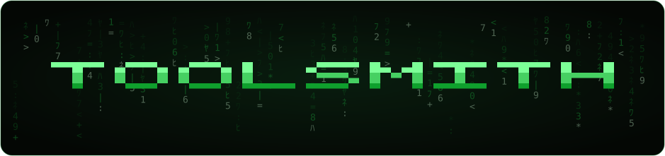

<p align="center">
  
</p>

# Agent Toolsmith

A general-purpose AI agent that writes its own tools. When it runs into a task it can't do, it builds the capability and keeps it for next time.

Most agents ship with a fixed toolset. This one starts with a single built-in tool — `evolve` — and builds the rest on demand. Each new tool is validated, saved to disk, and available immediately, compounding the agent's abilities across sessions.

> [!CAUTION]
> This is a personal experiment for didactic purposes only. It's rough around the edges and not battle-tested in any way.
>
> Tool code runs in-process with your privileges — there is no sandbox (for now). The system prompt instructs the agent not to write tools that delete data, leak secrets, or make irreversible changes unless asked, but of course this cannot be trusted.

## How It Works

The agent runs a standard agentic loop — stream a response, run any tool calls, feed the results back — until the model stops calling tools:

```
User input → Agent.turn() → LLM (stream) → text + tool calls
                  ▲                                │
                  │                                ▼
           tool results ◀───────────── execute tools (registry)
```

What makes it self-evolving is the `evolve` tool. When the model needs a capability it doesn't have, it defines one:

```
Task needs a capability the agent lacks
            │
            ▼
  Agent calls `evolve` { name, description, inputSchema, code }
            │
            ▼
  Code staged to a temp file → imported → validated
            │
            ├─ invalid ─→ error returned, nothing changes
            │
            ▼
  Promoted to ~/.agent-toolsmith/tools/<name>.ts
            │
            ▼
  Registered and callable immediately — available in this and future sessions
```

The `code` is the body of an `async (input) => { ... }` function that must return a string. Because it runs inside that function, tools use dynamic `import()` to reach Node built-ins; the `Bun` global, `fetch`, and the usual Node/Web globals are all available. Calling `evolve` again with an existing name replaces that tool, so the model can improve and/or fix existing tools.

## Tech Stack

- TypeScript
- Bun
- React 19
- Ink 7

## Prerequisites

- [Bun](https://bun.sh) JavaScript runtime
- [Anthropic](https://platform.claude.com) API key

## Setup

Install dependencies:

```sh
bun install
```

Set your API key and start an interactive chat:

```sh
export ANTHROPIC_API_KEY="sk-ant-..."
bun run src/index.ts
```

### Standalone binary

Compile a self-contained executable (bundles the Bun runtime and all dependencies):

```sh
bun run build.ts
./agent
```

## Usage

Type a message to chat with the agent. It will create and run tools as needed.

### Slash commands

| Command                | Description            |
| ---------------------- | ---------------------- |
| `/tools`               | List available tools   |
| `/tools remove <name>` | Remove a tool          |
| `/exit`, `/quit`       | Exit the agent         |

Press `Esc` to abort an in-flight response or close the overlay. Press `Ctrl+C` to quit.

## Storage

| Path                              | Contents                                      |
| --------------------------------- | --------------------------------------------- |
| `~/.agent-toolsmith/tools/`       | Evolved tools, one TypeScript file per tool   |
| `~/.agent-toolsmith/sessions/`    | Per-session JSONL transcripts                 |

## Architecture

Three layers — the **agent core**, a **pluggable LLM adapter**, and the **terminal UI** — held apart by two small interfaces. The agent drives the conversation without knowing which model backs it or how its output is shown: it reaches the model through `LlmClient` and emits a stream of `AgentEvent`s the UI renders. Everything else plugs into one of those two seams.

**`LlmClient`** (`agent/types.ts`) — a single `send(messages, tools, signal)` method returning an async stream of `text_delta`, `tool_call`, and a final `complete` event. To add a provider, write an adapter and list it in `adapters/llm/index.ts`; `resolveLlmClient` picks the first whose environment keys are present.

**`Tool`** (`agent/tools/types.ts`) — `{ name, description, inputSchema, execute }`. The registry holds tools in memory; the store persists evolved ones to disk as TypeScript and reloads them on launch. `evolve` is itself just a built-in tool that writes to the registry — the same seam every evolved tool flows through.

```
src/
├── index.ts                 Entry point — resolve an LLM client, construct the agent, render the TUI
│
├── agent/
│   ├── agent.ts             Agentic loop — turn() streams events, runs tools, feeds results back
│   ├── factory.ts           createAgent() — assembles registry, built-ins, and session
│   ├── session.ts           JSONL session logging
│   ├── types.ts             Core interfaces — LlmClient, AgentEvent, Message
│   └── tools/
│       ├── registry.ts      In-memory tool registry (register / add / remove / list)
│       ├── store.ts         Persists tools to disk; stage → validate → promote
│       ├── factory.ts       createToolRegistry() — loads saved tools on launch
│       ├── validate.ts      Tool name and metadata validation
│       ├── types.ts         Tool / ToolMetadata types
│       └── builtins/
│           ├── evolve.ts    The self-evolution tool
│           └── tool.ts.tpl  Template evolved tools are rendered into
│
├── adapters/
│   └── llm/
│       ├── index.ts         resolveLlmClient() — selects a provider from env keys
│       └── anthropic.ts     Anthropic implementation of LlmClient
│
├── tui/                     Ink/React terminal UI — App, components, slash commands, transcript
└── demo/                    Fake LlmClient, sample tools, and scripted scenarios (env DEMO=1)
```

## Development

```sh
bun test     # run all tests
bun check    # lint with Biome
bun format   # format with Biome
bun tsc      # type-check with TypeScript
```

Tests follow the classical (Detroit) school — behavior-focused, real objects over mocks, AAA pattern. See [docs/TESTING.md](docs/TESTING.md) for the full conventions.

Pre-commit checks are managed with [prek](https://github.com/j178/prek). Run them manually with:

```sh
prek -a  # lint, type-check, and test
```

CI runs the same lint, type-check, and test suite on every push via GitHub Actions.
